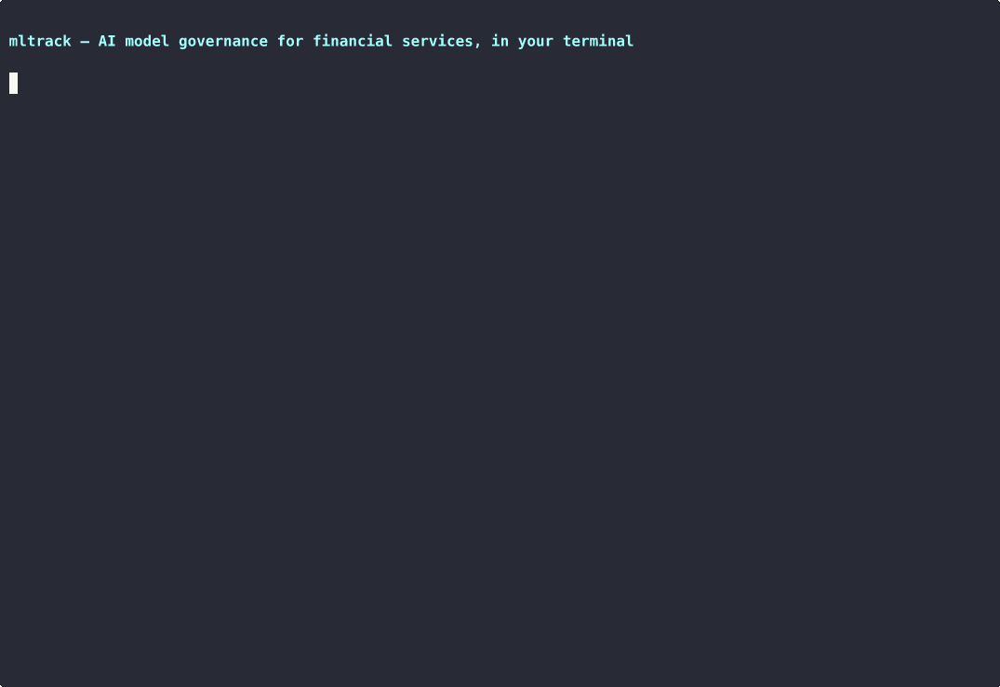
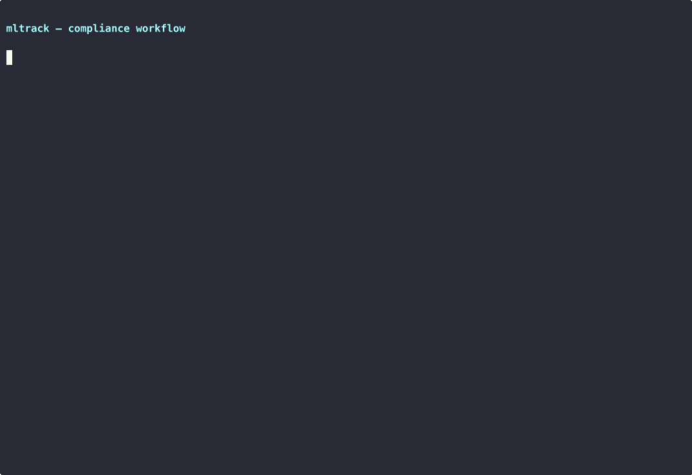
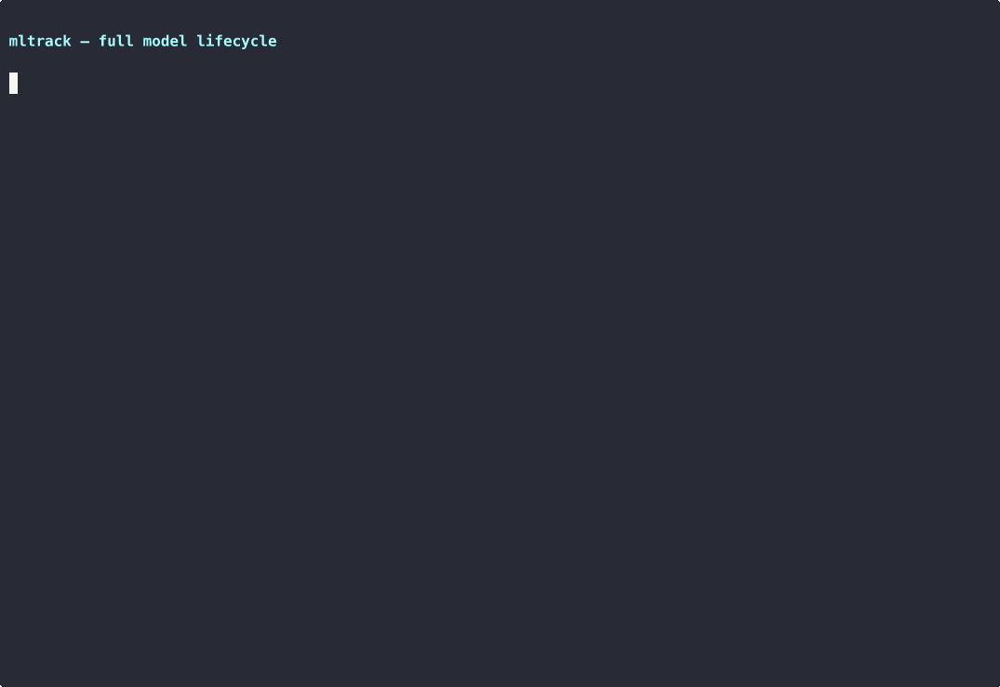
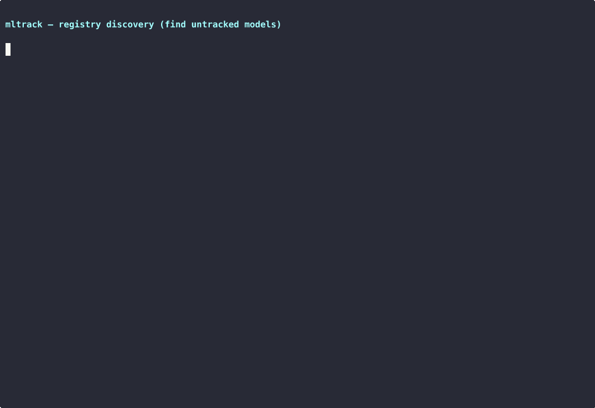
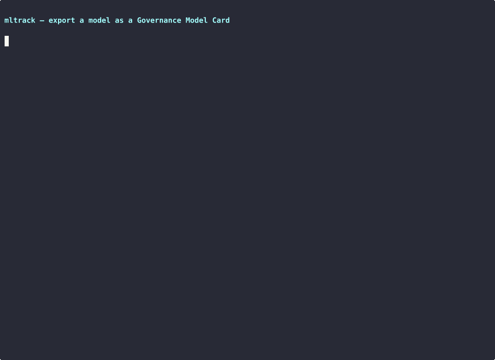

# mltrack

**CLI for AI model inventory and compliance tracking; maps to NIST AI RMF, ISO 42001, and SR 11-7 behind a fail-closed CI gate.**

[](https://www.python.org/downloads/)
[](https://opensource.org/licenses/MIT)
[](#testing)

## See it in action



> From an empty database to a governed inventory: model registry, risk-based review cycles (SR 11-7), and compliance validation — in under a minute. More demos [below](#demos).

**→ [Watch the design walkthrough on YouTube](https://youtu.be/SoOmpzHrt6s)** — three design decisions and a live terminal demo, in three and a half minutes.

## Why

Spreadsheets lose owners, review dates, and which models are actually deployed. mltrack is a governed inventory with review cycles set by risk tier, and `mltrack check` is a CI gate that exits non-zero when a model fails validation.

## Regulatory alignment

[NIST AI RMF](https://www.nist.gov/itl/ai-risk-management-framework) · [SR 11-7](https://www.federalreserve.gov/supervisionreg/srletters/sr1107.htm) · [ISO 42001](https://www.iso.org/standard/81230.html)

### NIST AI Risk Management Framework (AI RMF)

| NIST AI RMF Function | mltrack Feature | How It Helps |
|---------------------|-----------------|--------------|
| **GOVERN 1.1** - Legal/regulatory requirements | Risk tier classification | Maps models to review frequencies based on regulatory expectations |
| **GOVERN 1.5** - Ongoing monitoring | `mltrack validate --all` | Automated compliance checking across entire inventory |
| **GOVERN 4.1** - Organizational practices | Dashboard & reports | Centralized visibility into AI deployment landscape |
| **MAP 1.1** - Intended purpose documented | Use case field | Captures business context for each model |
| **MAP 1.5** - Risk assessment | Risk tier + validation rules | Identifies high-risk deployments requiring closer oversight |
| **MEASURE 2.2** - Evaluation documented | Review tracking | Maintains audit trail of periodic assessments |
| **MANAGE 1.1** - Risk response | Status lifecycle | Track deprecated/decommissioned models |
| **MANAGE 2.3** - Risk monitoring | Overdue review alerts | Proactive notification of governance gaps |

### Federal Reserve SR 11-7 (Model Risk Management)

SR 11-7 requires banks to maintain "a comprehensive set of models in use across the organization."

| SR 11-7 Requirement | mltrack Implementation |
|--------------------|------------------------|
| Model inventory | Full model registry with metadata |
| Ownership documentation | Business owner + technical owner fields |
| Risk ranking | Four-tier risk classification system |
| Ongoing monitoring | Risk-based review cycles (30/90/180/365 days) |
| Validation documentation | Review notes and date tracking |
| Reporting to board/management | Compliance and risk reports |

SR 11-7 also requires that model validation be conducted independently of model development. mltrack captures reviewer identity via `--reviewer`; enforcing independence separation is an organizational control outside the tool.

## Who this is for

- **Model risk teams** moving from a spreadsheet inventory to a registry with owners, risk tiers, and scheduled reviews.
- **ML platform engineers** adding a compliance gate to CI.
- **AI risk managers** who need a record of who reviewed a model, when, and a hash of the model state at that time.

## Features

| Feature | Description |
|---------|-------------|
| **Model Inventory** | Track AI models with vendor, ownership, risk tier, and deployment metadata |
| **Risk-Based Review Cycles** | Automatic review scheduling based on risk tier (Critical: 30d, High: 90d, Medium: 180d, Low: 365d) |
| **Compliance Validation** | Check models against governance requirements with detailed violation reports |
| **Defensible Audit Trail** | Structured, immutable review records with SHA-256 model state hashes for tamper evidence |
| **OSCAL Export** | Generate OSCAL 1.1.2 schema-valid Assessment Results — structured for regulatory documentation workflows |
| **Registry Discovery** | Connect to MLflow and list models missing from the inventory |
| **Interactive Dashboard** | Terminal dashboard with filtering and auto-refresh |
| **Audit Reports** | Generate compliance, inventory, and risk reports (terminal, CSV, JSON, OSCAL) |
| **Bulk Import/Export** | Import/export model data via CSV or JSON with field mapping |
| **Sample Data Generation** | Generate realistic financial services demo data |

## Installation

### Requirements

- Python 3.9 or higher
- pip

### Install from source

```bash
git clone https://github.com/joseruiz1571/mltrack.git
cd mltrack
pip install -e ".[dev]"
mltrack --version
```

Runtime dependencies: [Typer](https://typer.tiangolo.com/), [Rich](https://rich.readthedocs.io/), SQLAlchemy (SQLite by default). Optional extras: `mltrack[mlflow]`, `mltrack[card]` (`jsonschema`).

## Quick Start

### 1. Generate sample data

```bash
mltrack sample-data --count 20
```

This creates 20 AI models with financial-services use cases, mixed vendors, and a mix of compliant and overdue reviews.

### 2. View the dashboard

```bash
mltrack dashboard
```

Or with auto-refresh:

```bash
mltrack dashboard --watch --interval 30
```

### 3. Run compliance checks

```bash
mltrack validate --all
```

### 4. Add a model

Interactive:

```bash
mltrack add --interactive
```

Or with flags:

```bash
mltrack add \
  --name "claude-sonnet-4" \
  --vendor "Anthropic" \
  --risk-tier high \
  --use-case "Customer service chatbot for financial advice" \
  --business-owner "Jane Smith (Product)" \
  --technical-owner "ML Platform Team" \
  --deployment-date 2025-01-15 \
  --environment prod
```

## Demos

### Compliance workflow

From inventory to an audit-ready overdue-review report.



### Full model lifecycle

Register a model with full governance metadata, record a review (the next review is auto-scheduled from the risk tier), then deprecate it — the audit trail is preserved, not deleted.



### Registry discovery: find shadow AI

Scan an external model registry and surface models that exist in production but were never put on the governance inventory.



### Governance Model Card export

Export an inventory record as a schema-valid Governance Model Card, then validate it against the [Governance Card Stack](https://github.com/joseruiz1571/governance-card-stack) model-card schema — a CI-ready conformance gate.



> Recording scripts live in [`demo/`](demo/). Re-record any demo with `asciinema rec -c "bash demo/<name>.sh" demo/<name>.cast` and convert with `agg demo/<name>.cast demo/<name>.gif`.

## Command reference

### Model management

| Command | Description | Example |
|---------|-------------|---------|
| `mltrack add` | Add a new model | `mltrack add -i` |
| `mltrack list` | List all models | `mltrack list --risk critical` |
| `mltrack show <name>` | Show model details | `mltrack show claude-sonnet-4` |
| `mltrack update <name>` | Update a model | `mltrack update claude-sonnet-4 --status deprecated` |
| `mltrack delete <name>` | Delete a model | `mltrack delete old-model` |

### Compliance and reviews

| Command | Description | Example |
|---------|-------------|---------|
| `mltrack check <name>` | CI/CD compliance gate (exit 0/1) | `mltrack check fraud-detector --json` |
| `mltrack check` | Check the inventory or one tier | `mltrack check --all` · `mltrack check --risk critical` |
| `mltrack validate` | Validate compliance | `mltrack validate --all` |
| `mltrack validate` | One tier, one model, or JSON | `mltrack validate --risk critical` · `mltrack validate --model-id claude-sonnet-4` · `mltrack validate --all --json` |
| `mltrack reviewed <name>` | Record a review with audit trail | `mltrack reviewed claude-sonnet-4 -d today --outcome passed --reviewer "Jane Smith"` |
| `mltrack dashboard` | View dashboard | `mltrack dashboard --watch` |
| `mltrack dashboard` | Filter the dashboard | `mltrack dashboard --watch --interval 60 --risk high --environment prod --vendor anthropic` |

### Registry discovery

| Command | Description | Example |
|---------|-------------|---------|
| `mltrack discover` | Surface untracked models (demo mode) | `mltrack discover --source mock` |
| `mltrack discover` | Scan MLflow Model Registry | `mltrack discover --source mlflow --uri http://localhost:5000` |
| `mltrack discover` | Show only governance gaps | `mltrack discover --source mlflow --untracked-only` |
| `mltrack discover` | JSON output for scripting | `mltrack discover --source mlflow --json` |

### Reports

| Command | Description | Example |
|---------|-------------|---------|
| `mltrack report compliance` | Compliance status | `mltrack report compliance -f json -o report.json` |
| `mltrack report compliance` | OSCAL Assessment Results | `mltrack report compliance -f oscal -o assessment-results.json` |
| `mltrack report inventory` | Full inventory | `mltrack report inventory -f csv -o inventory.csv` |
| `mltrack report risk` | Risk analysis | `mltrack report risk` |

### Data operations

| Command | Description | Example |
|---------|-------------|---------|
| `mltrack import <file>` | Import from CSV/JSON | `mltrack import models.csv --update` |
| `mltrack import <file>` | Validate a file without writing | `mltrack import data.csv --validate` |
| `mltrack export <file>` | Export to CSV/JSON | `mltrack export backup.json --risk high` |
| `mltrack export <file>` | Export a slice or a blank template | `mltrack export production-models.csv --environment prod` · `mltrack export template.csv --template` |
| `mltrack sample-data` | Generate demo data | `mltrack sample-data -n 50 --clear` |

### Governance cards

Export an inventory record as a [Governance Card Stack](https://github.com/joseruiz1571/governance-card-stack) Model Card and validate it against the schema. Validation uses `jsonschema` when installed (`pip install 'mltrack[card]'`) and falls back to a built-in checker otherwise.

| Command | Description | Example |
|---------|-------------|---------|
| `mltrack card export <name>` | Export a model as a schema-valid Governance Model Card | `mltrack card export fraud-detector -o fraud-detector.card.json` |
| `mltrack card export <name>` | Print a card to stdout (pipe to `jq`) | `mltrack card export fraud-detector \| jq .metadata` |
| `mltrack card validate <file>` | Validate a card against the schema (exit 0/1, CI-ready) | `mltrack card validate fraud-detector.card.json` |

## Data model

### Risk tier review cycles

Aligned with SR 11-7:

| Risk Tier | Review Frequency | Typical Use Cases |
|-----------|------------------|-------------------|
| **CRITICAL** | Every 30 days | Trading algorithms, credit decisioning, fraud detection |
| **HIGH** | Every 90 days | Customer-facing chatbots, KYC verification, AML monitoring |
| **MEDIUM** | Every 180 days | Document summarization, internal search, meeting transcription |
| **LOW** | Every 365 days | Developer tools, test data generation, internal documentation |

### AIModel

Required: `model_name`, `vendor`, `risk_tier` (`critical`, `high`, `medium`, `low`), `use_case`, `business_owner`, `technical_owner`, `deployment_date`.

Optional: `model_version`, `deployment_environment` (`prod`, `staging`, `dev`), `api_endpoint`, `data_classification` (`public`, `internal`, `confidential`, `restricted`), `notes`.

Set by the tool: `status` (`active`, `deprecated`, `decommissioned`), `last_review_date`, `next_review_date` (from the risk tier).

### ModelReview

Each `mltrack reviewed` inserts one record: `reviewed_at`, `reviewer`, `outcome` (`passed`, `warning`, `failed`), `notes`, and `model_state_hash`. The hash is SHA-256 over the model definition at review time (name, vendor, risk tier, use case, owners, deployment date, version, environment, endpoint, data classification, status). Records are insert-only.

## Testing

641 tests.

```bash
pip install -e ".[dev]"
pytest
pytest --cov=mltrack --cov-report=term-missing
pytest tests/test_dashboard_command.py
pytest -k "test_validate"
```

| Category | Tests | Coverage |
|----------|-------|----------|
| Model Inventory (CRUD) | 183 | add, list, show, update, delete + storage engine + database |
| Compliance & Reviews | 98 | validate, review recording, model review audit trail, CI/CD gate |
| Registry Discovery | 72 | MLflow adapter, registry interface, discover command |
| Reports & Data Operations | 137 | compliance/inventory/risk reports, CSV/JSON import/export |
| Dashboard | 74 | Metrics, filtering, display, auto-refresh |
| Sample Data | 33 | Demo data generation |
| Governance Cards | 26 | Card export, validate, schema conformance drift guard |
| Integration & CLI | 18 | End-to-end workflow tests, CLI entry point |

## Project structure

```
mltrack/
├── src/mltrack/     # cli, core, models, adapters, schemas, services, display
├── tests/           # 641 tests
├── demo/            # asciinema scripts and GIFs
├── pyproject.toml
└── README.md
```

## Contributing

```bash
git clone https://github.com/joseruiz1571/mltrack.git
cd mltrack
pip install -e ".[dev]"
git checkout -b feature/your-feature
pytest
```

PEP 8, type hints on public functions, and tests for new behavior.

## License

MIT. See [LICENSE](LICENSE).

## Roadmap

### Done

- [x] `ModelReview` records with SHA-256 model state hashes
- [x] `mltrack reviewed` writes structured audit records
- [x] OSCAL 1.1.2 Assessment Results (`mltrack report compliance -f oscal`)
- [x] `mltrack check` CI gate (exit 0/1, `--all`, `--risk`, `--json`, silent by default)
- [x] `mltrack discover --source mlflow` (`--untracked-only`, `--json`; `pip install mltrack[mlflow]`)
- [x] `mltrack card export` / `mltrack card validate` against the governance-card-stack schema

### Next

- [ ] SageMaker, Azure ML, and Vertex AI registry adapters
- [ ] Multi-source discovery in one gap view
- [ ] `mltrack package` examination evidence bundles (SR 11-7, OCC 2011-12, NIST AI RMF templates)
- [ ] System Card and Agent Card export ([governance-card-stack](https://github.com/joseruiz1571/governance-card-stack) has a draft Agent Card schema)

## Author

Jose Ruiz-Vazquez — [GitHub](https://github.com/joseruiz1571) · [Controlled Vocabulary](https://controlledvocabulary.substack.com)

## Acknowledgments

Built with [Typer](https://typer.tiangolo.com/) and [Rich](https://rich.readthedocs.io/). Review cycles follow SR 11-7; control names follow the NIST AI RMF.

## Related

Inventory → cards → assurance and custody.

| Layer | Repo |
|-------|------|
| Inventory | **mltrack** (this repo) — model inventory and a CI gate |
| Cards | [governance-card-stack](https://github.com/joseruiz1571/governance-card-stack) — Model, System, and Agent Cards on one OSCAL spine |
| Assurance | [mlassure](https://github.com/joseruiz1571/mlassure) — conformance assessment against retrieved evidence |
| Custody | [colophon](https://github.com/joseruiz1571/colophon) — a signed session packet for agent tool use |

`mltrack card export` writes the Model Card the card stack validates. That card is the inventory record [mlassure](https://github.com/joseruiz1571/mlassure) can assess.
